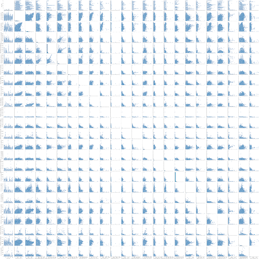
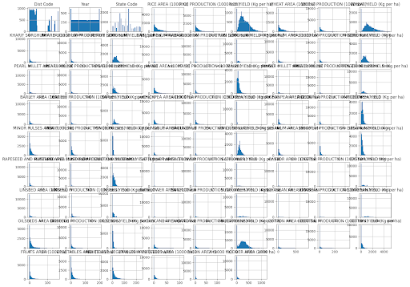
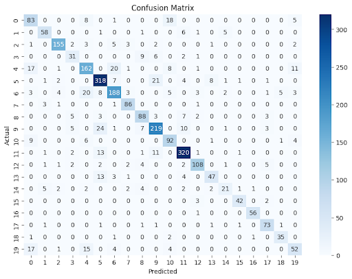
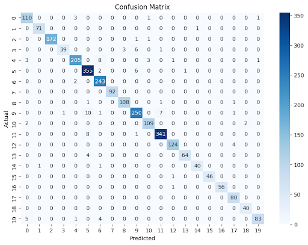
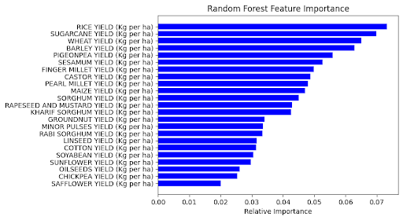

# AgricultureML
## Introduction
Our project aims to explore the relationships between crop yield, production, and area under cultivation. This study delves into an extensive dataset provided by the International Crops Research Institute for the Semi-Arid Tropics (ICRISAT), focusing on the District Level Database (DLD) for Indian agriculture. The dataset encompasses a wide range of data points across various districts in India, revealing relationships between the yield of certain crops and the location at which they are grown. 

The choice of this topic is motivated by the pivotal role agriculture plays in India's economy and environment. Agriculture is the backbone of the country and makes up the majority of the country’s GDP and provides food to billions of people around the world. Studying the relationship between climate and the growth of crops in the country has worldwide impacts because these crops end up in supermarkets worldwide and a decrease in yield could have devastating impacts such as famine and starvation for millions. 

The project hopes to improve agricultural practices, optimize resource allocation, and ultimately bolster food security. A predictive model that can accurately forecast crop yield based on various parameters could serve as a valuable tool for farmers, policymakers, and researchers across the agricultural industry. Such a model could aid in identifying key regions for technology, initiatives, and facilitate targeted interventions to boost crop production.

Essentially, this project is more than just a group project but a step towards empowering farmers, enhancing agricultural productivity, and contributing to the broader goals of economic development and sustainability in India. Through data analysis and modeling, we aim to uncover insights that will pave the way for a more prosperous and stable agricultural future.

## Methods
### Data Exploration:
Our initial step involves examining the dataset and finding the minimum, maximum, median, and counts of our dataset. We also identified that the missing values were encoded as -1 instead of NaN in our dataset. This step was crucial in guiding our preprocessing decisions and model selection. We created pairplots to uncover any hidden relationships in our data and we printed out the columns to see which features we wanted to include in our final model since we had 79 columns or features to choose from. Then we got histogram representations of each column to identify any distribution patterns.

### Preprocessing:
All of our data is numerical. In our dataset, we discovered that there were missing data values but they were encoded with the number -1. We could resolve this by using strategies like taking a random value in the range or by using the mean or we will throw those values out. In our case, we decided to throw the data values out because we were worried that when training our classifier, choosing a random value could cause the model to perform poorly since it will be trained on randomly generated data that may or may not conform to the trends in the data. If there was categorical data, we would need to label or one hot encode the values but the dataset is all numerical. 

Some strategies we used to preprocess our data is doing min-max normalization in order to get all our numbers within a specific range. We will do this because comparing crop yields across different states is challenging since one crop could produce 50kg per hectare and others can produce 5 tons per hectare and it would be hard to compare without some sort of normalization technique. We will also throw out any missing values by only taking into account observations with values >= 0 because we don't want to normalize a distribution with numbers from -1 to n because it would throw the entire distribution off. We also ignored many of the columns in our dataset and only focused on the columns with yield and the corresponding state code because 79 columns of data were impractical to plot and analyze. 

### Model 1 - Logistic Regression:

Our first predictive model was Logistic Regression. We chose this model for its simplicity and effectiveness in binary classification tasks. The parameters for the model were chosen to optimize performance: max_iter=1000, multi_class='multinomial'.

### Model 2 - Random Forest Classifier
Our second model was a Decision Tree classifier. It is known for its ease of use and a greater level of complexity than regression models. We used Decision Trees to understand the feature importance and the decision-making process better. We fine-tuned the number of trees, depth of the tree, and the splits of a tree as hyperparameters to prevent overfitting and improve accuracy on top of doing k-fold cross validation.

### Model 3 - Deep Neural Network
Lastly, we implemented a DNN, which is particularly known for its customizability and ability to prevent problems like overfitting through dropout layers. The network architecture was designed with multiple dense and dropout layers for classification. The model parameters, such as the number of units, layers, and the learning rate were tuned to optimize the network's performance. We also performed cross validation to verify the fit of our model and to get a more accurate measure for accuracy.

## Results

### Model 1 - Logistic Regression
The logistic regression model is either underfitting or might be a good fit based on the train and test error. The train and test accuracy is very similar which is a good thing because it indicates that the model is not overfitting to the training data and causing it to perform poorly on the test dataset. However, logistic regression is a pretty simple model and because we have so many features in our dataset, it could not be capturing the complexities in the dataset as well as it could be, despite a high 82% accuracy on our model. The decision boundary might not be a good fit for the data because it is too simple to capture all the classes in the feature space. Below is the confusion matrix of our first model’s performance.

### Model 2 - Random Forest Classifier
We trained our second model which was a random forest classifier and we got Train Error: 0.01 and Test Error: 2.05 which was significantly smaller than the logistic regression model that we used initially. I think our model is a lot more complex than the logistic regression model and is closer to fitting just right compared to the logistic regression which was likely underfitting the data. We implemented hyper parameter tuning and k-fold cross validation so we can average out the model to give us an indicator if the model is overfitting. 

The result of the hyperparameter tuning is that a max depth of 20, minimum samples split of 2, and n estimators of 300 gave us the best results and got us to 96% accuracy. When we did k-fold cross validation for k=5 we got the following accuracies: 0.77956792 0.91724643 0.86671549 0.83376053 0.81282051 and it gave us a Mean cross-validation score of 0.84. Below is the confusion matrix for the Random Forest’s performance.

Additionally, we can see which features the random forest prioritized. We graphed them below.

### Model 3 - Deep Neural Network
We used the same data labels and scaling as in the Random Forest Classifier. For our loss function, we used sparse categorical cross entropy and experimented with different model optimizers (Adam and SGD). We have plenty of data points for each region, so we should have enough data points to achieve reasonable accuracy. We got a MSE train error of about 7.6 and a test error of about 9.8.

The result of the hyperparameter tuning with the best parameters is the number of hidden layers of 1, model units is 512, learning rate of 0.001 and achieved a best accuracy of 76%. When verifying our result with k-fold cross validation (k=5), we got the following the accuracy scores for each fold: 0.67118272 0.80959356 0.75137312 0.75503479 0.71391941], and it gave a mean cross-validation score of 0.74. Again, we graph the confusion matrix below

## Discussion
### Model 1 - Logistic Regression
The conclusion of our first model implied that there are some features of a state's crop yields and statistics which can be used to identify it. This is very good news because it means our problem is actually solvable. If there was no relationship between our X and y, we would have to choose a different set of features to look at. In order to improve our model, we could do some hyperparameter tuning. We could experiment with different solvers and/or stopping criteria for our Logistic Regression Model.

### Model 2 - Random Forest Classifier
The conclusion of our second model implies that there are some features of a state's crop yields and statistics which can be used to identify it. It shows that there is a stronger link between the features and the state code than we originally imagined. In the end we had an accuracy of 84% by running the k-fold cross validation on the most optimal hyperparameters which was higher than the logistic regression likely because the model was more complex and was able to fit the data in a more complex manner. To improve the decision trees, it would be nice if we had the computational power to build more expansive trees and have a greater depth. Despite these limitations, this was our best model by accuracy.

### Model 3 - Deep Neural Network
Our third model seems to imply that our neural network is slightly overfitting our data. It is possible that our data is not as complex as we originally thought, and a random forest / logistic regression is a better model for our data. Initially, we overfitted even more (91% train accuracy vs a 60% test) with a hard coded 3 hidden layers, so we hyperparameter tuned on hidden layers and found that only 1 layer produced the best result. To improve our model, we can test other properties, like activation functions, loss functions, and model optimizers which could produce better results.

## Conclusion
In conclusion, our exploration into the agricultural data set to predict crop yields in India has uncovered patterns and relationships that could potentially aid in improving agricultural productivity and decision-making processes.

Reflecting on our approach, there are several areas where we could have improved. For instance, the handling of missing data represented by -1 values could be re-evaluated. Instead of simply deleting them, more sophisticated imputation techniques could be used to infer missing values, potentially leading to more accurate model predictions.

In terms of modeling, while we experimented with logistic regression, decision trees, and a deep neural network, the exploration of other models or ensemble methods could offer additional insights. While DNNs have the potential to capture deep patterns in data, their performance heavily relies on the correct configuration and adequate training. Additionally, exploring other advanced machine learning models or hybrid approaches might have provided a more comprehensive way to understand our data or improve performance.

Looking forward, there's a plethora of opportunities for further research. Integrating external data, such as weather or soil quality, could add depth and additional features to our analysis. Additionally, delving into more advanced feature engineering or exploring the temporal aspect of the data could uncover new dimensions of insight rather than a multiclass classification problem. 

## Collaboration
Because there were only two of us, we did not find it necessary to designate a project leader. Instead we used pair programming for the entirety of the coding portions in the notebook. For the writeup, we discussed what we wanted to include in each section, wrote down a rough draft of what each of us wanted it to look like, and combined the parts we thought were most relevant and informative in the final draft. This really revealed the speed of having a small team, as we only needed to communicate and discuss with one other person in order to make changes in our project.

Setup Instructions: 
Download and clone the Colab notebook. Any necessary imports or pip installs are included at the top of the notebook already. 

## Milestones
### Milestone 2
All of our data is numerical. In our dataset, we discovered that there were missing data values but they were encoded with the number -1. We could resolve this by using strategies like taking a random value in the range or by using the mean or we will throw those values out. In our case, we decided to throw the data values out because we were worried that when training our classifier, choosing a random value could cause the model to perform poorly since it will be trained on randomly generated data that may or may not conform to the trends in the data. If there was categorical data, we would need to label or one hot encode the values but the dataset is all numerical. 

Some strategies we will use to preprocess our data is doing min-max normalization in order to get all our numbers within a specific range. We will do this because comparing crop yields across different states is challenging since one crop could produce 50kg per hectare and others can produce 5 tons per hectare and it would be hard to compare without some sort of normalization technique. We will also throw out any missing values by only taking into account observations with values >= 0 because we don't want to normalize a distribution with numbers from -1 to n because it would throw the entire distribution off. We also ignored many of the columns in our dataset and only focused on the columns with yield and the corresponding state code because 42 columns of data were impractical to plot and analyze. 

### Milestone 3
The model is either underfitting or might be a good fit based on the train and test error. The train and test accuracy is very similar which is a good thing because it indicates that the model is not overfitting to the training data and causing it to perform poorly on the test dataset. However, logistic regression is a pretty simple model and because we have so many features in our dataset, it could not be capturing the complexities in the dataset as well as it could be, despite a high 82% accuracy on our model. The decision boundary might not be a good fit for the data because it is too simple to capture all the classes in the feature space.

The next two models we are thinking about trying is a deep neural network and a random forest. We have been learning about deep neural networks in class, and I think this will be more effective than logisitic regression in our classification problem. A DNN might be able to capture some of the hidden patterns in our data that logistic regression cannot capture. A random forest classifier may also be appropiate for our problem. Random forests also are used for classification and are also not as computationally expensive as a DNN.

The conclusion of our first model implies that there are some features of a state's crop yields and statistics which can be used to identify it. This is very good news because it means our problem is actually solvable. If there was no relationship between our X and y, we would have to choose a different set of features to look at. In order to improve our model, we could do some hyperparameter tuning. We could experiment with different solvers and/or stopping criteria for our Logistic Regression Model.

### Milestone 4
The data seemed sufficient because we have over ten thousand observations and labels to where we didn't need to generate additional data. We trained our second model which was a random forest classifier and we got Train Error: 0.01 and Test Error: 2.05 which was significantly smaller than the logistic regression model that we used initially. I think our model is a lot more complex than the logistic regression model and is closer to fitting just right compared to the logistic regression which was likely underfitting the data. We implemented hyper parameter tuning and k-fold cross validation so we can average out the model to give us an indicator if the model is overfitting. 

The result of the hyperparameter tuning is that a max depth of 20, minimum samples split of 2, and n estimators of 300 gave us the best results and got us to 96% accuracy. When we did k-fold cross validation for k=5 we got the following accuracies: 0.77956792 0.91724643 0.86671549 0.83376053 0.81282051 and it gave us a Mean cross-validation score of 0.84.

The last model we are thinking about trying is a convolutional neural network. We have been learning about convolutional neural networks in class, and I think this will be more effective than logistic regression in our classification problem. A DNN might be able to capture some of the hidden patterns in our data that logistic regression cannot capture and it might be computationally less expensive than a super expansive decision tree. 

The conclusion of our second model implies that there are some features of a state's crop yields and statistics which can be used to identify it. It shows that there is a stronger link between the features and the state code than we originally imagined. In the end we had an accuracy of 84% by running the k-fold cross validation on the most optimal hyperparameters which was higher than the logistic regression likely because the model was more complex and was able to fit the data in a more complex manner. To improve the decision trees, it would be nice if we had the computational power to build more expansive trees and have a greater depth. 

### Milestone 5
We used the same data labels and scaling as in the Random Forest Classifier. For our loss function, we used sparse categorical cross entropy and experimented with different model optimizers (Adam and SGD). We have plenty of data points for each region, so we should have enough data points to achieve reasonable accuracy. We got a MSE train error of about 7.6 and a test error of about 9.8.

The result of the hyperparameter tuning with the best parameters is the number of hidden layers of 1, model units is 512, learning rate of 0.001 and achieved a best accuracy of 76%. When verifying our result with k-fold cross validation (k=5), we got the following the accuracy scores for each fold: 0.67118272 0.80959356 0.75137312 0.75503479 0.71391941], and it gave a mean cross-validation score of 0.74.

